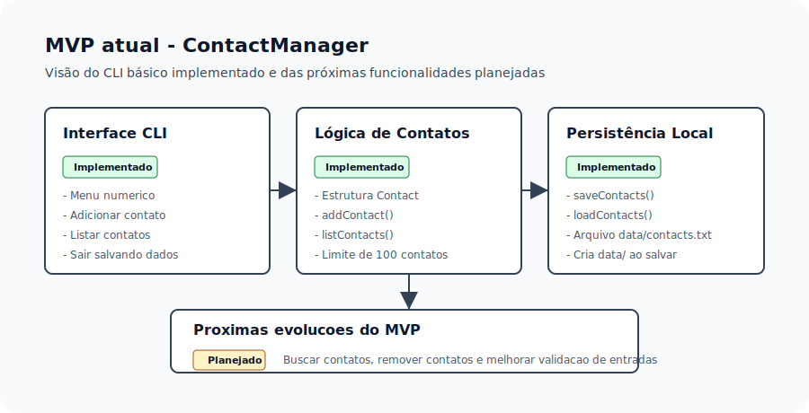

# ContactManager
---

ContactManager é um protótipo de sistema de gerenciamento de contatos para terminal desenvolvido em C.



O projeto foca em:
- operações básicas de cadastro, consulta, remoção e persistência de contatos.
- organização modular de código em `include/` e `src/`.
- documentação técnica e rastreamento do desenvolvimento.

# Objetivo

Permitir que um usuário manipule contatos em linha de comando e mantenha os dados gravados localmente em arquivo.

# Escopo atual

* Adicionar contatos
* Listar contatos
* Salvar contatos em arquivo
* Carregar contatos ao iniciar
* Encerrar o programa salvando os dados

# Funcionalidades planejadas

* Buscar contatos
* Remover contatos
* Melhorar validação das entradas

# Estrutura do projeto

```
ContactManager/
├─ README.md
├─ LICENSE
├─ docs/
│  ├─ README.md
│  ├─ arquitetura.md
│  ├─ casos-de-uso.md
│  ├─ fluxos.md
│  ├─ modelos-de-dados.md
│  ├─ product-backlog.md
│  ├─ requisitos.md
│  ├─ resultados.md
│  ├─ testes.md
├─ diario/
│  ├─ diario.md
│  ├─ 2026-05-31.md
│  ├─ 2026-06-05.md
│  ├─ 2026-06-09.md
│  └─ 2026-06-11.md
├─ include/
│  ├─ contact.h
│  └─ storage.h
└─ src/
   ├─ main.c
   ├─ contact.c
   └─ storage.c
```

# Como compilar e executar

O projeto está em desenvolvimento, mas o fluxo básico de adicionar, listar, carregar e salvar contatos já pode ser compilado:

```bash
mkdir -p data
gcc -Iinclude src/main.c src/contact.c src/storage.c -o contactmanager
./contactmanager
```

# Status do projeto

* `src/main.c` contém menu interativo com opções para adicionar, listar e sair.
* `src/contact.c` implementa `addContact` e `listContacts`.
* `src/storage.c` implementa `saveContacts` e `loadContacts` usando `data/contacts.txt`.
* `removeContact` e `findContact` estão declaradas em `include/contact.h`, mas ainda não foram implementadas.
* O menu ainda não possui opções de busca e remoção.

# Documentação

* `docs/README.md` — índice da documentação do projeto.
* `docs/requisitos.md` — requisitos funcionais e não funcionais.
* `docs/arquitetura.md` — arquitetura do sistema em C.
* `docs/casos-de-uso.md` — casos de uso e diagramas.
* `docs/fluxos.md` — fluxos operacionais do sistema.
* `docs/modelos-de-dados.md` — modelo de dados e formato de persistência.
* `docs/product-backlog.md` — backlog de funcionalidades.
* `docs/resultados.md` — resultados concluídos.
* `docs/testes.md` — casos de teste.
* `diario/diario.md` — histórico de desenvolvimento.
* `CONTRIBUTING.md` — guia de convenção de commits.

# Convenção de commits

Use prefixos de commit para organizar o histórico do projeto:

- `STR:` — estrutura e refatoração
- `FEAT:` — nova implementação ou função
- `FIX:` — correções de bug
- `TEST:` — testes, builds e validações
- `DOCS:` — documentação
- `CHORE:` — manutenção geral

# Observações

O projeto está em fase de desenvolvimento. A documentação diferencia o que já está implementado no CLI básico do que permanece planejado para as próximas etapas.
