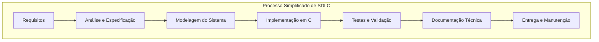

# ContactManager 
---

Sistema de gerenciamento de contatos em ambiente de terminal desenvolvido em linguagem ``C``

O projeto tem como objetivo exercitar fundamentos de engenharia de software, programação em C, modelagem de requisitos, documentação técnica, persistência de dadis e organização modular de código. 

# Objetivos 

* Gerenciar contatos via terminal 
* Armazenar contatos localmente 
* Aplicar um processo simplificado de SLDC 
* Desenvolver boas práticas de engenharia de software 

# Funcionalidades 

* Adicionar contatos 
* Listar contatos 
* Buscar contatos 
* Remover contatos 
* Salvar dados em arquivos 
* carregar arquivos ao iniciar 

# Estrutura do Projeto 
```
ContactManager/
|__docs/
|___src/
|___include/
|___data/
|___tests/
|
|___.gitignore
|
|___README.md
|___MAKEFILE
```

# Processo de Desenvolvimento 

 
# Tecnologias 

* Linguagem C 
* GCC
* Make
* Linux
* Vs Code 
* CLI 
* CLang 
* Debbuger
* Bash 
* Git & GitHub 

# Status - Fase Atual 
```
[  ]  Requisitos
[  ]  Casos De Uso  
[  ]  Modelos De Dados 
[  ]  Arquitetura 
[  ]  Implementação 
[  ]  Testes 
[  ]  Conclusão 
```
---
```
Autor -  Manoel E. S. S
E-mail - ghostnether28@gmail.com
```
---