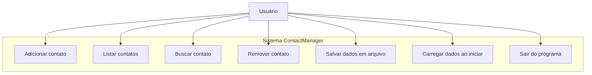

# Casos de Uso

## Descrição geral
Este documento descreve os casos de uso do sistema ContactManager e a interação do usuário com as funcionalidades implementadas e planejadas.

## Caso de Uso Principal

## Casos de Uso Detalhados

### Caso de Uso: Adicionar contato
Estado: implementado.

- O usuário seleciona a opção de adicionar contato.
- O sistema solicita nome e telefone.
- O sistema armazena o contato em memória.
- O sistema retorna ao menu principal.

### Caso de Uso: Listar contatos
Estado: implementado.

- O usuário seleciona a opção de listar contatos.
- O sistema exibe todos os contatos presentes em memória.
- O sistema retorna ao menu principal.

### Caso de Uso: Buscar contato
Estado: planejado.

- O usuário seleciona a opção de buscar contato.
- O sistema solicita o termo de busca.
- O sistema exibe os contatos cujo nome ou telefone contenham o termo.
- O sistema retorna ao menu principal.

### Caso de Uso: Remover contato
Estado: planejado.

- O usuário seleciona a opção de remover contato.
- O sistema solicita o nome ou o índice do contato.
- O sistema remove o contato correspondente da memória.
- O sistema atualiza o arquivo de dados e retorna ao menu.

### Caso de Uso: Persistência de dados
Estado: implementado.

- O sistema carrega contatos do arquivo ao iniciar.
- O sistema salva contatos no arquivo antes de encerrar.

## Notas
- O ator principal é o usuário do terminal.
- O sistema deve ser simples e responder via CLI.
- Por agora, o foco é validar as operações básicas e estabelecer a arquitetura de persistência.
