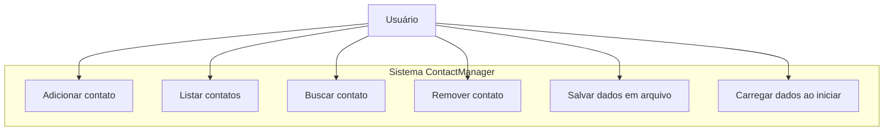
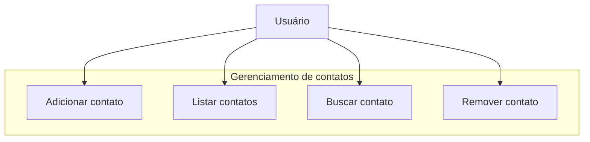
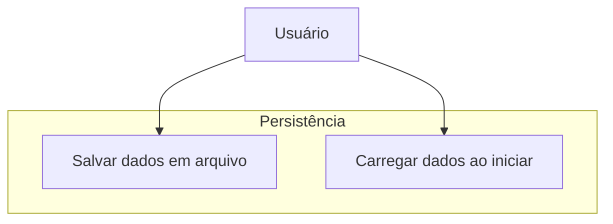

# Casos de Uso

## Descrição geral
Este documento apresenta os casos de uso principais do sistema ContactManager em diagramas Mermaid.

## Caso de Uso Principal

## Casos de Uso Detalhados
### Caso de Uso: Gerenciar contatos

### Caso de Uso: Persistência de dados

## Notas
- O ator principal é o usuário do terminal.
- O sistema suporta operações básicas de CRUD e persistência entre execuções.
- Os diagramas mostram a interação do usuário com as funcionalidades de gerenciamento e armazenamento.
