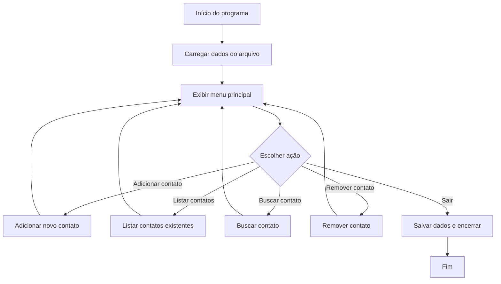

# Fluxos do Sistema

Este documento descreve os principais fluxos de interação do usuário e do sistema no ContactManager.

## Fluxo de Inicialização


## Fluxo de Adicionar Contato
```mermaid
flowchart TD
    Start[Seleciona "Adicionar contato"] --> Input[Solicitar dados do contato]
    Input --> Validate[Validar entrada]
    Validate -- Válido --> Save[Salvar contato na memória]
    Save --> Persist[Atualizar arquivo de dados]
    Persist --> Confirm[Mostrar mensagem de sucesso]
    Confirm --> Menu[Retornar ao menu]
    Validate -- Inválido --> Error[Mostrar mensagem de erro]
    Error --> Input
```

## Fluxo de Buscar Contato
```mermaid
flowchart TD
    Start[Seleciona "Buscar contato"] --> Query[Solicitar termo de busca]
    Query --> Search[Pesquisar contatos]
    Search --> Found{Contato encontrado?}
    Found -- Sim --> Show[Exibir contato(s)]
    Found -- Não --> None[Mostrar "nenhum resultado"]
    Show --> Menu[Retornar ao menu]
    None --> Menu
```

## Fluxo de Remover Contato
```mermaid
flowchart TD
    Start[Seleciona "Remover contato"] --> Query[Solicitar nome ou ID]
    Query --> Search[Localizar contato]
    Search --> Found{Contato encontrado?}
    Found -- Sim --> Confirm[Confirmar remoção]
    Confirm -- Sim --> Delete[Remover contato da memória]
    Delete --> Persist[Atualizar arquivo de dados]
    Persist --> Success[Mostrar confirmação]
    Success --> Menu[Retornar ao menu]
    Confirm -- Não --> Menu
    Found -- Não --> None[Mostrar "contato não encontrado"]
    None --> Menu
```
