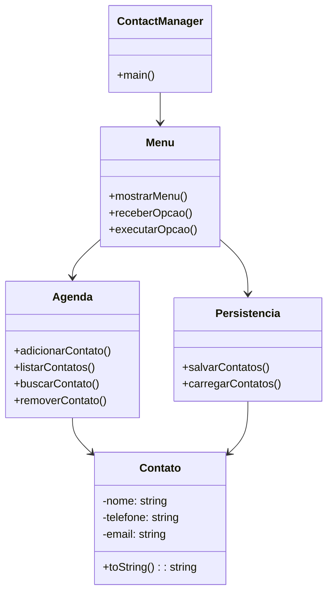

# Diagrama UML

Este documento contém o diagrama UML de classes para o sistema ContactManager.

```mermaid
classDiagram
    class ContactManager {
        +main()
    }
    class Menu {
        +mostrarMenu()
        +receberOpcao()
        +executarOpcao()
    }
    class Agenda {
        +adicionarContato()
        +listarContatos()
        +buscarContato()
        +removerContato()
    }
    class Persistencia {
        +salvarContatos()
        +carregarContatos()
    }
    class Contato {
        -nome: string
        -telefone: string
        -email: string
        +toString(): string
    }

    ContactManager --> Menu
    Menu --> Agenda
    Menu --> Persistencia
    Agenda --> Contato
    Persistencia --> Contato
```
